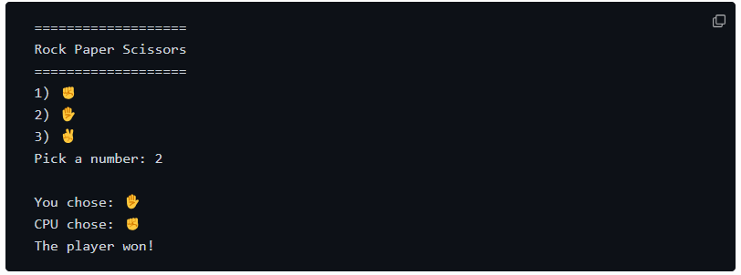

# Rock-Paper-Scissors-Mini-Project

### This is a checkpoint project I decided to do from Codedex. Originally the expected output noted by Codedex was simple, as the show in the image below.

## Extra Features
### In the project specification, there's a bonus part which I could've done however, I chose to add my own features to challenge myself, here's a list of what I added:

* A loop so the game can run for a set number of time, which is 3 and that is tracked by the score.
* A leaderboard to show the score at the end of the game.
* A play again logic.
* Although adding emojis doesn't enhance the code functionality, I added them for a better UX as I am only coding in Python and haven't planned to make a front-end for this mini project.

## Tools Used
### [Codedex](https://www.codedex.io/python/checkpoint-project/rock-paper-scissors)  - Used to get project specification.
### Chat GTP - Used to check for errors and troubleshoot code.
### [Real Python](https://realpython.com/python-rock-paper-scissors/) - Used to get coding inpiration.
### GitHub - Host code and ReadMe file.
### VS Code - Create code and ReadMe.

## Future Improvements
* Create a front-end and publish a website.
* Ask the user how many times they want to play, with a limit, this will be tracked using the score system like in this iteration of the code.